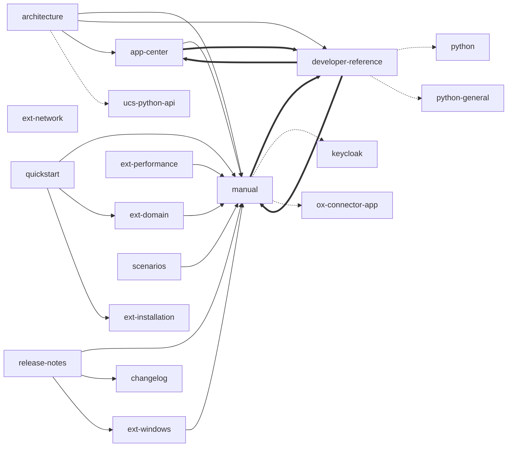

<!--
SPDX-FileCopyrightText: 2021-2024 Univention GmbH

SPDX-License-Identifier: AGPL-3.0-only
-->

# Univention production documentation for UCS

This directory contains the product documentation related to UCS.

## Contribution

Every contribution to the documentation is welcome and appreciated. The
workflow regarding issues and bugs is the same as with implementing software.

For your content, consider the [Documentation Style
Guide](https://hutten.knut.univention.de/mediawiki/index.php/Documentation_Style_Guide).

For contribution to RST content, see the [Working with
Sphinx](https://hutten.knut.univention.de/mediawiki/index.php/Docs#Working_with_Sphinx)
section in the Internal wiki.

For contribution to DocBook content, see the [DocBook
article](https://hutten.knut.univention.de/mediawiki/index.php/Docbook) in the
Univention Internal wiki.

## Versioning of documentation

All documents, except the `changelog` and the `release-notes`, use the major
and minor version numbers for the deployment path and within the document.

### General documents

You configure the document target version with `DOC_TARGET_VERSION` in
[base-doc.yml](./../.gitlab-ci/base-doc.yml).

You **must** update the `DOC_TARGET_VERSION` upon a new minor release for UCS.

### Changelog and release notes

The version string for the UCS changelog and release notes goes down to the
patch level.

For each new UCS patch level releases, you **must** update the
`CHANGELOG_TARGET_VERSION` in [base-doc.yml](./../.gitlab-ci/base-doc.yml), for
example `5.1-0`. The version string **must not** contain spaces. Keep in mind,
the version string is used for the deployment path of the document.

To reference the correct changelog document in the release notes, use the following steps:

1. Adjust `CHANGELOG_TARGET_VERSION`.
2. Write and publish the changelog document.
3. Adjust the URL value to the new changelog document location in the
   `intersphinx_mapping` variables (English and German language settings) in
   the release notes [conf.py](./release-notes/conf.py).

## General Makefile

In the documentation root directory `doc/` there is a Makefile. You can use it
to run the Sphinx make targets over all documentation.

Examples. Run the commands from the UCS repository `/doc` directory.

* Cleanup all build artifacts: `make clean`

* Build all HTML files: `make html`

* Build all PDF files: `make latexpdf`. Build PDF files requires the
  full Sphinx Docker image, which is about twice the size of the Sphinx base
  image.

* Spell check documents: `make spelling`


### Translations

All documents in this directory are written in English as their default
language. Some documents also offer a German translation.

To check, if your changes to the documentation needs an update of the
translation, run `make update-po` from the repository `/doc` directory.
The command downloads the Sphinx Docker image and updates the PO files for
all documents with the translation.

The default language for the update is German. To update the translation for
another language, for example French, run `make -C doc -e LANGUAGE="fr"
update-po`.

Other translation related targets are the following:

* `stat-po` to show translation statistics about translated, fuzzy and
  untranslated strings.

* `stat-po-nodocker`: Same as `stat-po` without running the commands in a
  Docker container. This make target requires a Sphinx environment.

Local alternative:
```sh
make gettext
msgmerge -U locales/de/LC_MESSAGES/index.po _build/gettext/index.pot
semsible-editor locales/de/LC_MESSAGES/index.po
git add -- locales/de/LC_MESSAGES/index.po
git commit -m '…'
git push
```


## Circular Dependencies

Extracted from `sed -ne '/^intersphinx_mapping/,/^}/{/^intersphinx_mapping/F;/:/p}' */conf.py`:

There is two cycles preventing a clean build:
- `developer-reference` <-> `app-center`
- `developer-reference` <-> `manual`
