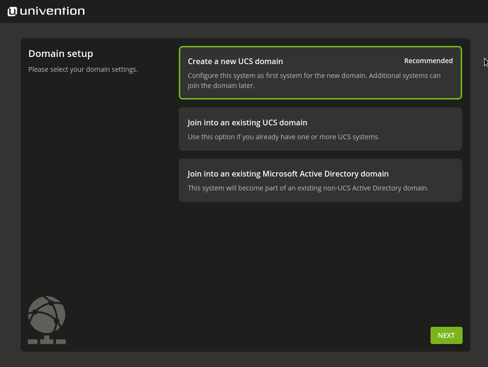

#################################################
Quick start guide for Univention Corporate Server
#################################################

.. _quickstart:intro:

************
Introduction
************

Univention Corporate Server (UCS) is a server operating system based on
Debian GNU/Linux with integrated management system for the central
administration of servers, services, clients, desktops and users.

This quickstart guide offers a short introduction on how to get started
with UCS. Several features of UCS are only mentioned briefly with a
reference to further documentation. The documentation on UCS is
available at https://docs.software-univention.de/.

The installation DVD can be downloaded from the Univention website at
https://www.univention.com/downloads/download-ucs.
The installation DVD is only available for the host architecture *amd64*
(64-bit). It has support for the Unified Extensible Firmware
Interface-Standard (UEFI) including SecureBoot.

Alternatively preinstalled images for VMware and VirtualBox can be used from the
same download page.

The system requirements vary considerably depending on the intended
purpose and the number of users. The minimum requirements for the
installation are 1 GB memory and 8 GB hard drive space.

.. _quickstart:installation:

************
Installation
************

The installation is performed via a menu-driven installer and can be
used both interactively and completely profile-based, see the
`Extended installation documentation <ext-doc-inst_>`_.

The system language, keyboard layout and time zone can be selected in
accordance with local requirements.

A valid network configuration should be set during the installation. If,
for example, a gateway and a name server are specified, but the name
server cannot be reached, this may result in unnecessary timeouts. In
these cases, it makes more sense not to specify a gateway. The network
configuration can be employed using DHCP. If there is already a name
server available in the local network, it should be used. If additional
UCS systems are installed in the domain at a later point in time, the
|UCSPRIMARYDN| and any |UCSBACKUPDN| systems should be entered as name
servers.

.. _quick-systemrole:

   
   Selecting the domain setup

During installation, the system can be used for various purposes which
can only be configured at this point in the setup process.

- The system is to be the first system in a new UCS domain and it is implicitly
  configured with the system role |UCSPRIMARYDN|.

- The system can be joined into an existing Active Directory domain.  Select
  this option if UCS should not create a new domain. UCS then takes on the role
  of an Active Directory member server.

- All other systems are joining the UCS domain when they are installed.

An overview of the other different system roles can be found in [#ucs-systemrole]_.

With UCS and the *Active Directory Takeover* an
existing Active Directory domain can be migrated completely to UCS. For
information on how to set up the UCS system for this scenario, see
[#ad-takeover]_.

In the subsequent course of the installation, the fully qualified host
name, under which the computer should be accessible in the network, is
entered for a |UCSPRIMARYDN|. A local name should also be used as the
domain name in this case, e.g., company.intranet. (If the system is used
as a mail server, for example, the mail domains can be used
independently of the domain names). For example, to commission the
*mailserver* host system in the ``company.intranet`` DNS domain,
``mailserver.company.intranet`` should be entered as the fully qualified
host name. The *LDAP base* is suggested based on the
fully qualified host name and only needs to be adjusted in exceptional
cases. For all other systems roles it is normally sufficient to enter
the host name only. The domain name will we fetched from the
|UCSPRIMARYDN| when the domain is joined. The root password must be at
least eight characters long and is also set as the password for the user
*Administrator* during the installation of the
first UCS system (|UCSPRIMARYDN|).

An auto-partitioning feature can be used during the installation which
creates an LVM volume group on the first hard drive by default.

The installed software components can be adapted later at any time and
subsequently installed from the Univention App Center.

After confirming the configuration settings the installation is
initiated. Once completed, the system must be restarted. The further
configuration is made using the |UCSUMC| (UMC). This is described in more
detail in the following chapter.

.. _quickstart:administration:

*****************
UCS web interface
*****************

The web interface of an installed UCS system is directly available via its IP
address (``https://server_ip`` or ``http://server_ip``, HTTPS is
recommended). By default, a portal page is configured on the
|UCSPRIMARYDN| where all applications are listed that are installed in the
domain. For all other system roles, the start site consists of an
overview of all locally installed applications. (View as well as the
partitioning of entries can be customized in a very flexible manner, see
also [#ucs-portal]_.)

.. _quick-ucs-portal:

.. figure:: images/ucs-portal.png

   Illustration of the portal page on the |UCSPRIMARYDN| with all domain wide
   available applications

On each start site of a UCS system, there is an entry :guilabel:`System and
domain settings` in the section :guilabel:`Administration` (or :guilabel:`System
settings`, respectively) that points to the |UCSUMC| (UMC) of the
local system. |UCSUMC| is the central tool for web-based administration of
a UCS domain. There are different modules available on the UCS system
depending on the installation and system role selected. The login to
|UCSUMC| is performed as user ``Administrator`` with the password specified
for the user ``root`` during the installation.

For administrating UCS, the LDAP directory is the central component of a
UCS domain. In the LDAP, domain wide information such as the users,
groups and computer accounts is saved. Depending on the settings, this
information is replicated to the other Directory Nodes in the domain
either completely or selectively. The UMC modules which edit the LDAP
directory directly can be accessed only on the |UCSPRIMARYDN| via |UCSUMC|.
Furthermore, they can also be controlled using the command line
interface |UCSUDM|, see [#ucs-udm]_.

.. _quick-umc-overview:

.. figure:: images/umc-modules.png

   Modules in the UMC

.. _quickstart:updatesinstall:

********************************************
UCS updates / Installing additional software
********************************************

UCS updates can be installed in the UMC module :guilabel:`Software
update`.

Additional software, like for example the Active Directory Connection,
can be installed using the Univention App Center in the Univention
Management Console:

- Additional UCS software can be installed/removed using the category
  :guilabel:`UCS components`.

- Third-party software (e.g. various groupware solutions) and UCS-compatible
  add-on products (e.g. `UCS@school` for school deployment can also be installed
  through the App Center.

.. _quick-appcenter:

.. figure:: images/appcenter.png

   Subsequent installation of UCS components

.. _quickstart:ucr:

****************************************************************
Configuration management using Univention Configuration Registry
****************************************************************

Univention Configuration Registry is the central tool for managing the
local system configuration of a UCS system. Settings are specified in a
consistent format, the so-called Univention Configuration Registry
variables. These variables are used to generate the configuration files
used effectively by the services/programs. Direct editing of the
configuration files is only needed in exceptional cases.

|UCSUCR| variables are managed via the |UCSUMC| module :guilabel:`Univention
Configuration Registry`. Configuration files are automatically
updated when the UCR variables registered on them are changed.

.. _quick-ucr:

.. figure:: images/ucr.png

   Managing |UCSUCR| variables

.. _quickstart:clients:

*******
Clients
*******

In addition to the UCS systems, a UCS domain can also integrate
different clients. The following clients are supported:

- Microsoft Windows clients can join an AD-compatible Windows domain provided by
  the *Active Directory compatible domain controller* component (implemented
  using the software Samba). Further information on setting up Samba and the
  domain join of Windows clients can be found in [#ucs-winjoin]_.

- macOS systems are also integrated via a Samba-based, AD-compatible Windows
  domain. Further information on setting up Samba and the domain join can be
  found in [#ucs-macjoin]_.

- Ubuntu systems\ [#ubuntu-join]_ and other Linux distributions like Debian, SUSE or Red Hat can
  also be integrated into the domain, see [#integrate-other-linux]_.

.. _quickstart:extend:

*******************************
Further expansion of the domain
*******************************

This quickstart guide only provides an entry into UCS. UCS is very
scalable, additional services can simply be installed on additional
systems. This domain join is described in [#ucs-join]_.

UCS offers various additional services which are covered by the UCS
license and which can be integrated at a later point in time:

- Single-sign-on with web services using a SAML identity provider, see
  [#domain-saml]_.

- IP management using DHCP, see [#ucs-dhcp]_.

- Web proxy for caching and policy management / virus scan, see [#ucs-proxy]_.

- Hybrid cloud setups

.. _quickstart:furtherinfo:

*******************
Further information
*******************

|UCSUCS| provides comprehensive documentation:

- The primary source of information on UCS is the UCS manual\ [#ucs-handbuch]_.

- Further documentation for advanced scenarios can be found in the extended
  documentation. The various documents are linked at
  https://docs.software-univention.de/.

- The `Univention Wiki <https://wiki.univention.de/index.php/Main_Page>`_) contains several
  HOWTOs and hands-on tips.

- Answers to frequently asked questions can be found in the `support and
  knowledge database (SDB)
  <https://help.univention.com/c/knowledge-base/supported/48>`_).

- Questions on UCS can be asked at `Univention Help
  <https://help.univention.com/>`_.

.. rubric:: References

.. [#ucs-systemrole] `UCS Manual - System roles <https://docs.software-univention.de/manual-5.0.html#systemrollen>`_
.. [#ad-takeover] `Migrating an Active Directory domain to UCS using Univention
   AD Takeover
   <https://docs.software-univention.de/manual-5.0.html#windows:adtakeover>`_
.. [#ucs-portal] `UCS manual - Portal page as central view on the UCS domain <https://docs.software-univention.de/manual-5.0.html#central:portal>`_
.. [#ucs-udm] `Command line interface of domain management (Univention Directory
   Manager) <https://docs.software-univention.de/manual-5.0.html#central:udm>`_ 
.. [#ucs-winjoin] `UCS Manual - Windows domain joins
   <https://docs.software-univention.de/manual-5.0.html#windows-domaenenbeitritt>`_
.. [#ucs-macjoin] `UCS Manual - Mac OS X domain joins <https://docs.software-univention.de/manual-5.0.html#joining-macos>`_
.. [#ubuntu-join] `Integration of Ubuntu clients into a UCS domain <https://docs.software-univention.de/domain-5.0.html#ext-dom-ubuntu>`_
.. [#integrate-other-linux] `Integration of Linux/Unix systems into a UCS domain <https://docs.software-univention.de/domain-5.0.html#ext-dom-unix>`_
.. [#ucs-join] `UCS Manual - How UCS systems join domains <https://docs.software-univention.de/manual-5.0.html#linux-domaenenbeitritt>`_
.. [#domain-saml] `SAML identity provider <https://docs.software-univention.de/manual-5.0.html#domain:saml>`_
.. [#ucs-dhcp] `UCS manual - IP assignment via DHCP <https://docs.software-univention.de/manual-5.0.html#module:dhcp:dhcp>`_
.. [#ucs-proxy] `UCS manual - Web proxy for caching and policy management /
   virus scan
   <https://docs.software-univention.de/manual-5.0.html#ip-config:Web_proxy_for_caching_and_policy_management__virus_scan>`_
.. [#ucs-handbuch] `Univention Corporate Server - Manual for users and administrators <https://docs.software-univention.de/manual-5.0.html>`_

.. Macro substitutions

.. |UCSPRIMARYDN| replace:: Primary Directory Node
.. |UCSBACKUPDN| replace:: Backup Directory Node
.. |UCSUMC| replace:: Univention Management Console
.. |UCSUDM| replace:: Univention Directory Manager
.. |UCSUCS| replace:: Univention Corporate Server
.. |UCSUCR| replace:: Univention Configuration Registry

.. Link references without translation

.. _ext-doc-inst: https://docs.software-univention.de/installation-5.0.html
