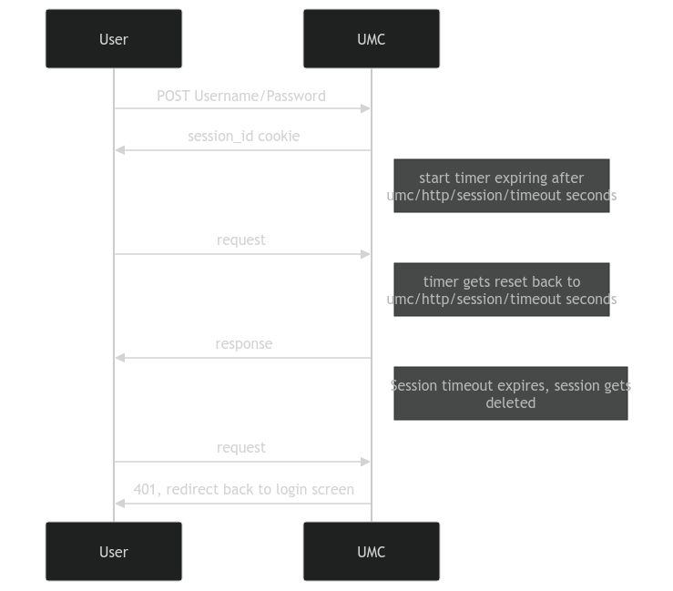

# Univention Management Console

The Univention Management Console (UMC) Server is a JSON based, RPC like, un-stateless session based, modular web service,
serving as backend for the Dojo based UMC user interface as well as parts of the Portal, Self-Service and other small web UIs.

## Architecture

The architecture of UMC is described from a high level perspective in the [architecture documentation](https://docs.software-univention.de/architecture/latest/en/services/umc.html).
Further development information can be obtained in the [developer reference](https://docs.software-univention.de/developer-reference/latest/en/umc/index.html).

### Code
The code for the following functionality is defined in:
* The UMC server, application containing the URL routes: [server.py](src/univention/management/console/server.py)
* The UMC module process server: [modserver.py](src/univention/management/console/modserver.py)
* The base class for resources / request handler: [resource.py](src/univention/management/console/resource.py)
* All internal core resources: [resources.py](src/univention/management/console/resources.py)
* Session handling: [session.py](src/univention/management/console/session.py)
* SAML: [saml.py](src/univention/management/console/saml.py)
* OpenID-Connect: [oidc.py](src/univention/management/console/oidc.py)
* Authentication and authorization: [pam.py](src/univention/management/console/pam.py), [auth.py](src/univention/management/console/auth.py), [acl.py](src/univention/management/console/acl.py)
* Handling of UMC module and category XML definition: [module.py](src/univention/management/console/module.py), [category.py](src/univention/management/console/category.py)
* `Base` class where all UMC modules must inherit from as `Instance` class: [base.py](src/univention/management/console/base.py)

### Core HTTP endpoints

The UMC-Server provides some core HTTP endpoints, other endpoints are served by module processes.
The core endpoints are for example:
* authentication via form based plaintext credentials
* authentication via SAML assertion
* authentication via OIDC access token
* logout for plain, SAML and OIDC
* setting of a new password while providing the current password
* session information retrieval
* retrieval of most likely IP address of the client, used by UCS@school
* session renewal (drop current module processes), e.g. used after an app installation
* listing of available modules
* listing of available categories
* uploading of files and getting a base64 representation of that file for further use in Javascript, e.g. previewing as new user photo jpeg
* Command and Upload handler for forwarding requests to UMC module processes
* retrieval of meta information about the domain and system, like cookie banner, SSL validity dates, system UCS version or license, etc. The information differ based on the login state to prevent information disclosure.
* retrieval of various or all UCR variable as authenticated user, (yes, every user in the domain can read the whole UCR!)
* retrieval of UCS version and SSL validity state
* retrieval of all UMC hosts in the domain
* retrieval of user preferenes like favorites
* setting of user preferenes like favorites

### Modularity via module processes
The UMC-Servers functionality can be extended by adding modules to it.
Modules consist of a Python module, a Javascript module and a XML file describing the module.

Modules have a unique ID and serve the requests for `/univention/command/$moduleid/.*` and `/univention/upload/$moduleid/.*`.

For each session (logged in user) and each module an own linux process is started, which serves a HTTP server via a UNIX socket.
This is very memory consuming (at least 30 MB per process) and bad practice. Many modules wouldn't need this as they are designed stateless.
A experimental untested flag to prevent this exists, via a flag `<module singleton="1" …>` flag in the XML definition.
Especially modules with `allow_anonymous="true"` like the self service should use this, as they should be already independent of any session and these modules allow unauthenticated access, opening the way up for denial of service.

Module processes are terminating themself after 10 minutes of inactivity, configurable via `umc/module/timeout`.

### Authentication
Authentication can be done via providing the credentials via the form based `/univention/login/` to `/univention/auth/`.
This is additionally the officially used API for service to service communication, e.g. by `univention.lib.umc`.
Login via SAML is provided by `/univention/saml/`, via OIDC is provided by `/univention/oidc/`.
The UMC-Server can additionally be accessed via HTTP Basic authentication and HTTP Bearer authentication.
All of the authentication mechanism will create a cookie based session. The cookie is not necessary for HTTP based authentication but is still given.

Authentication is realized via the `univention-management-console` PAM stack, which defines:
1. authentication for local users via `pam_unix`, UDM users or computers via `pam_krb` and `users/ldap` users via `pam_ldap`.
2. account management (checks for disabled accounts, expired passwords, locked accounts) is done via the same above modules.
3. password changes are done for local users via `pam_unix` and for UDM accounts via `pam_krb5`, which ensures that all password hashes keep in sync. The password complexity requirements are at least ensured via `pam_cracklib`, `UDM` and `pam_krb5`.

#### Sessions
The session lifetime depends on the authentication mechanism.

##### Plain login
Plain login sessions don't have a session lifetime per se but rather a session timeout.
This timeout is configured by `umc/http/session/timeout`.
It gets reset during requests to UMC endpoints which don't set `self.ignore_session_timeout_reset` to true.


##### SAML login
The length of SAML sessions is equal to the length of the SAML assertion lifetime.
More specifially the `NotOnOrAfter` assertion.
The SAML assertion lifetime can be set with the `umc/saml/assertion-lifetime` UCRV, which defaults to 5 minutes.

When using Keycloak, changing this variable will cause the SAML client for this UMC to be updated in Keycloak with the new assertion length, using `univention-keycloak`.
Note: The client name is composed of `https://$fqdn/saml/metadata`, so this only works when using the default client.
When using SimpleSAMLphp, modifying this variable will cause the UDM `saml/serviceprovider` entry for this UMC to get modified.

SAML session length does not get reset on requests, the session will end when the lifetime is over.
However the UMC frontend does a passive login on SAML session timeout which will cause a new session to be created, making it look like the user was never logged out.
This is however a new session. It is not a refresh of the old session but a completely new session, with a new session id.

##### OIDC Login
The length of an OIDC session is equal to the length of the refresh token.
There is currently no way to change the length of the refresh token through a UCRV, it has to be done directly in Keycloak/the OpenID provider.

In Keycloak, by default, the length of the refresh token is the length of the session.
This doesn't mean however that the refresh token is valid for the entire Keycloak session.
The session might time out on the Keycloak side or get manually logged out in the Admin UI.

The refresh token is being used to get new access tokens, which have a lifespan of 5 minutes by default in Keycloak.
The access token in turn is then passed to PAM/LDAP as authentication.

This access token however has nothing to do with the session length in the UMC, which determined only by the refresh token lifetime.

As with SAML the timeout of the session is not reset by requests.
The UMC session ends when the refresh token expires which is, by default, also when the Keycloak session expires.

#### Session storage in memory
All sessions are stored in memory and not in some external database like `sqlite`, `redis`, etc.
Therefore login states are lost after a restart of the UMC server.
To prevent session loss during a UCS upgrade via UMC we are preventing the restart of the service during upgrades.

#### Session storage in a database
It is also possible to configure an SQL store for sessions.
This can be done via the `univention-management-console-settings` utility.
This SQL store does *NOT* make sessions persistent between UMC restarts, or allows a request to be served by a UMC process other than the one that created it.
The UMC is still stateful.

The use case for this SQL session store is mostly for [OIDC backchannel logouts](https://openid.net/specs/openid-connect-backchannel-1_0.html).
Since the logout token request sent by the OP to the RP does not contain any sticky sessions it can land on any UMC, when multiprocessing is enabled or the Portal is load-balanced between multiple machines.

This is implemented in [session_db.py](./src/univention/management/console/session_db.py) which is doing the actual interaction with the database and [session_dict.py](./src/univention/management/console/session_dict.py) which is a class implementing `collections.abc.MutableMapping` and is a replacement for the plain session dict.

If a database is configured, the session will automatically get added/removed from the dict and when looking up a session it is only returned if it exists locally and in the database.

Furthermore to make the portal logout refresh work with backchannel OIDC logout and multiprocessing, a pub-sub system in implemented.
Currently it is implemented using PostgreSQL [listen](https://www.postgresql.org/docs/current/sql-listen.html)/[notify](https://www.postgresql.org/docs/current/sql-notify.html) and therefore only works if the configured database is PostgreSQL.

### Authorization
All authenticated users are granted access to all internal core resources.
Access to module processes is handled via `Policy: UMC` UDM policies, which reference `Settings: UMC operation set` UDM modules, defining the allowed UMC commands / requests paths, flavors, options.
The UMC policies can be assigned to the user object, computer object or a group containing the user or computer. Policies assigned to the container are not evaluated.
ACLs for local users like `root` or `__systemsetup__` are not stored in LDAP but in the local cache files managed by `/usr/sbin/univention-management-console-acls`.

### Detection of https for constructing redirect URIs
UMC-Server and Portal sit behind a Apache gateway, which stores the information about HTTPS of the original connection in the request header `X-UMC-HTTPS`.
This is e.g. used to construct the correct redirection URLs.

### Enabling of multiprocessing
Multiprocessing can be activated via
```bash
ucr set umc/http/processes=0
systemctl daemon-reload
systemctl restart apache2 univention-management-console-server
```
by specifying a number of forked processes (or `0` for based on the number of CPUs).

UMC doesn't use native multiprocessing but starts multiple UMC server processes via `systemd` and load balances via Apache with sticky sessions between them.
That is unfortunately necessary because of the module processes, which communicate via UNIX sockets instead of TCP sockets, which doesn't allow multiple connections.
Enhancing this could improve scaling very much.

### Known issues regarding performance or memory consumption

Production environments should read and perform steps from our [performance documentation](https://docs.software-univention.de/ext-performance/latest/en/).

* Authentication and password changes happen in a thread pool, configurable via `umc/http/maxthreads` defaulting to 35.
* UMC module processes take at minimum 30 MB RAM. One module process is created per module per session (user).
* The default session timeout for plain logins (not SAML or OIDC) is 28800 seconds / 8 hours (`umc/http/session/timeout`) and refreshes itself by that time at every request.
  This holds the session open for 8 hours of inactivity. Many opened sessions will cause a lot of unfreeable memory.
* Apache performance settings are configurable via `apache2/server-limit`, `apache2/max-request-workers`, ~`apache2/maxclients`~, `apache2/start-servers`, `apache2/min-spare-servers`, `apache2/max-spare-servers`.
* UMC performance settings are configurable via `umc/http/processes`, `umc/http/maxthreads`, `umc/http/requestqueuesize`.

### Debugging UMC-Server or module processes

The loglevel can be set via UCR:
```bash
ucr set umc/{module,server}/debug/level=4
```
Afterwards a service restart or reload is necessary.

The UMC server can be started in foreground, even with starting module processes in foreground:

```bash
univention-management-console-server -d4 -L /dev/stdout --no-daemonize-module-processes
```

A breakpoint with `pdb` helps to analyze problems, e.g. in module processes or in the server itself.

#### Analyzing memory leaks

Print the amount of objects to the logfile:
```bash
apt install python3-objgraph
tail -f /var/log/univention/management-console-server.log &
pkill -SIGUSR2 -f univention-management-console-server
```

Watch memory usage continuously:
```bash
PIDS="$(pgrep -f univention-management-console-server)"
while sleep 2; do for PID in $PIDS; do grep RssAnon "/proc/$PID/status"; done; done
```

Attach to a running UMC server process and analyze local variables, etc:
```bash
apt install python3-pip gdb python3-dev python3-dbg
pip install pyrasite
# echo 0 > /proc/sys/kernel/yama/ptrace_scope
PID="$(pgrep -f univention-management-console-server)"
pyrasite-shell "$PID"
```

Use `objgraph` to search for circular references (when attached with `pyrasite`):
```python
import gc, objgraph, univention
# objgraph.show_most_common_types(limit=20)
gc.collect()
objgraph.show_most_common_types(limit=20)
obj = objgraph.by_type('univention.management.console.session.Session')[-1]
objgraph.show_backrefs([obj], max_depth=10)
```

Other resources:
[diagnosing memory leaks in python](https://chase-seibert.github.io/blog/2013/08/03/diagnosing-memory-leaks-python.html)
[Heapy](https://guppy-pe.sourceforge.net/#Heapy)
[gdb-heap](https://github.com/rogerhu/gdb-heap)
[meliae](https://launchpad.net/meliae) e.g. required for `pyrasite-memory-viewer`

## OAuth 2.0 Authorization in UCS and OIDC Authentication in UMC

### Glossary
#### OIDC / OAuth 2

- **OAuth 2.0**: OAuth 2.0 is an authorization framework for secure resource sharing.

- **OIDC**: OpenID Connect is an identity layer built on top of OAuth 2.0, designed for authentication and identity verification. It introduces identity-related features to OAuth 2.0.

#### Tokens

- **ID-Token**: In OIDC, an ID-Token is a JSON Web Token (JWT) that carries identity information of an authenticated user. Defined in [OIDC Core, Section 2](https://tools.ietf.org/html/rfc6749#section-4.1.2.1).

- **Access Token**: An Access Token is used in OAuth 2.0 to authorize access to protected resources. Defined in [OAuth 2.0, Section 1.4](https://tools.ietf.org/html/rfc6749#section-1.4).

- **Refresh Token**: Used to obtain a new access token after the original access token expires. Provides long-term access to resources and is usually tied to the client's authorization.

- **Bearer Token**: A type of access token that is presented by the client when accessing protected resources. Typically used in the "Bearer" HTTP authentication scheme. Defined in [Bearer Token Usage](https://tools.ietf.org/html/rfc6750).

- **JWT (JSON Web Token)**: A compact, URL-safe means of representing claims to be transferred between two parties. Can be used as access tokens, ID tokens, or in other contexts where data needs to be securely transmitted.

#### Token Information

- **Claim**: A piece of information in a token that describes a user's identity or attributes.

- **AZP (Authorized Party)**: An optional claim in the ID-Token, representing the party to which the ID-Token was issued. Defined in [OIDC Core, Section 5.1](https://tools.ietf.org/html/rfc6749#section-5.1).

- **AUD (Audience)**: The audience for a token, indicating the recipient for which the token is intended. Defined in [OAuth 2.0, Section 2.1](https://tools.ietf.org/html/rfc6749#section-2.1).

#### Roles (Parties and Providers)

- **Resource Owner (RO)**: The user who owns the resource being accessed.

- **User Agent**: The user's client device (e.g., web browser or mobile app) used for user interactions and redirections in the authorization process.

- **Client**: The application requesting access to a user's resources. It is either public or private.

- **Authorization Server**: Responsible for authenticating the user and issuing access tokens. It plays a central role in the OAuth 2.0 and OIDC protocols.

- **Resource Server (RS)**: The resource server hosts protected resources and is capable of accepting and responding to protected resource requests.

- **OpenID Provider (OP)** (OIDC): In OIDC, the OpenID Provider is the identity provider responsible for authenticating users and issuing ID-Tokens. It is a specialized form of an authorization server. Defined in [OIDC Core, Section 2](https://tools.ietf.org/html/rfc6749#section-4).

- **Relying Party (RP)** (OIDC): A relying party is an application or service that relies on received tokens to access protected resources or verify user identity. It can be a client application in OAuth 2.0 or OIDC.

#### Authentication Flows and Grant types
OAuth 2.0 defines various flows to enable secure authorization and resource access. A grant is the way how the credentials are exchanged.
The most commonly used ones are:

- **Authorization Code Flow**: Used by confidential clients to obtain an access token by exchanging it with an authorization code.

- **Authorization Code Flow with PKCE**: Enhancement of authorization code flow with Proof Key for Code Exchange to protect against *code* interception attacks [RFC 7636](https://tools.ietf.org/html/rfc7636).

- **Implicit Flow**: Used by public clients to obtain an access token directly (instead of a code). Discouraged for security reasons

- **Client Credentials Flow**: Used by confidential clients to obtain an access token using client credentials.

- **Resource Owner Password Credentials Flow**: Allows a resource owner to provide credentials directly to the client, which then exchanges them against a token.

- **Device (Code) Flow**: Used by devices that do not have a browser to obtain user consent.

- **Refresh Token Flow**: Used by clients to exchange a refresh token with an access token when it has expired without involving the user agent.

##### Authorization Code Flow

- **Authorization Code**: A short-lived code that the client uses to obtain an access token from the authorization server.

- **Client ID**: A unique identifier for the client application, which is registered with the authorization server.

- **Client Secret**: A shared secret key between the client and the authorization server (used by confidential clients).

The Authorization Code Flow is one of the most secure OAuth 2.0 flows and is often used for web and mobile applications. In this flow:

1. The client initiates the authorization request and redirects the user to the authorization server.

2. The user authenticates and consents to the client's request.

3. The authorization server redirects the user back to the client with an authorization code.

4. The client exchanges the authorization code for an access token.

### Meaning of Audience, Authorized Party in ID-Token and Access-Token
An ID Token (OIDC) is intended for a Relying Party ("Client" in OAuth 2) which transfers the identity of the user.
An Access Token (OAuth 2) is intended for a Resource server. In the beginning no structure for access tokens were defined, therefore it was opaque for the client. A relatively new standard (RFC 9068) now defines the structure.

The Audience (aud) in an Access Token should contain an identifier for the resource server (e.g. "ldaps://example.org/").
See [JWT spec](https://datatracker.ietf.org/doc/html/rfc7519#section-4.1.3) and the description of `aud` in [RFC 9068](https://datatracker.ietf.org/doc/html/rfc9068#JWTATLRequest).
An access token is a bearer token and the OAuth standard family doesn't seem to have a concept of the resource server being able or required to check if the client is trusted by the resource server. The latest addition [OAuth 2.0 DPoP](https://www.rfc-editor.org/rfc/rfc9449.html) has some potential for that, but that may be to early to adopt to.

The Audience (aud) in a ID-Token refers to the client/Relying Party (e.g. "https://example.org/univention/oidc/").
See [id\_token specified in OIDC](https://openid.net/specs/openid-connect-core-1_0.html#IDToken), where `aud` refers to the client/RP. That's exactly what the [JWT spec](https://datatracker.ietf.org/doc/html/rfc7519#section-4.1.3) says: `aud` tells who shall evaluate the specific JWT.

Multiple entries in the Audience claim are allowed.

Maybe we need to make use of the [RFC8707 Resource Indicator](https://www.rfc-editor.org/rfc/rfc8707.html) to give a hint to Keycloak what value to put into the `aud` claim of the access token.
A Resource Server must check the Audience in an Access Token and a Relying Party/Client must ignore it.

The Authorized Party (azp) in an Access Token should contain one or more trusted relying parties.
A Relying Party/Client must check if the Authorized Party was issued for itself.
A Resource Server does not need to validate the AZP - but it's also not forbidden to do this. It usually doesn't know the corresponding client/RP.
https://community.auth0.com/t/azp-field-in-the-access-token/46724/4

// Aber in der Tat ist in https://datatracker.ietf.org/doc/html/rfc9068#name-validating-jwt-access-token nicht die Rede von azp sondern von aud.
// Ist ein bisschen verwirrend. https://stackoverflow.com/questions/41231018/openid-connect-standard-authorized-party-azp-contradiction z.B. redet über die ID-Token aber ich stimme zu, das dort ebenfalls verlinkte [doc](https://openid.net/specs/openid-connect-core-1_0.html) lese ich so, dass azp die client\_id enthalten sollte von der RP, die das token angefragt hat. aud hingegen muss auch die client\_id enthalten, kann aber zusätzlich weitere identifier enthalten, und dazu gehört meinem Verständnis nach auch die proteted resource.

#### Keycloak defaults are wrong:
The default access token in Keycloak looks like a mess:
* It doesn't have an `aud` claim at all
* It has an `azp` claim instead, which is non-standard in the OAuth 2.0 world: It's neither part of RFC 7519 nor of RFC 9068 nor RFC 8707. It is in fact only defined in the of the OpenID-Connect core standard and shall mention the client/RP in an *ID token*.
* It doesn't follow RFC 9068 in other aspects either, see https://github.com/keycloak/keycloak/discussions/19419 and https://github.com/keycloak/keycloak/discussions/8646

The Keycloak documentation describes one way to
* [Automatically add audience](https://www.keycloak.org/docs/latest/server_admin/#_audience_resolve) but the description is a bit cryptic. AFAIU the resource server would need to be represented in Keycloak by creating a `bearer-only client` and then the `aud` for the access token should be derived automatically from the associated `scope` claims.
* ^ That mechanism is explicitly referred to in the introduction of [RFC 8707](https://datatracker.ietf.org/doc/html/rfc8707), which suggests a different method, where the client/RP can specify to the IdP which `resource` it intends to access. In our case the UMC could append `&resource=ldaps%3A%2F%2Fexample.com/` to its request to the authorization (and/or token) endpoint of the IdP. In this case `ldaps://example.com` would be an "abstract identifier" that each LDAP-server in that domain identifies with (so to speak).
* But [Keycloak doesn't implement RFC8707 yet](https://github.com/keycloak/keycloak/issues/14355), instead it supports the parameter `&audience=...`
* (Instead of making the scope derivation dance described in [Automatically add audience](https://www.keycloak.org/docs/latest/server_admin/#_audience_resolve) Keycloak also documents how to [add a Hardcoded audience](https://www.keycloak.org/docs/latest/server_admin/#_audience_hardcoded), that the client can request by specifying e.g. `&scope=ldap-service`, but that's just a minor implementation difference internal to Keycloak. The only advantage I see is that one would not need to explicitly create a `bearer-only client` representing the LDAP-servers in Keycloak.)

TODO: when Keycloak supports the official `?audience=…` RFC 8707 we should change the hardcoded aud mapper, so that UMC explicitly requests the permissoins for LDAP access.

### Realization of the security concept

The following roles are taken:
- **Keycloak**: Authorization Server / OpenID Provider
- **UMC**: Relying Party/client (validates ID Token); some kind also additionally takes the role of Resource server.
- **LDAP-server**: Resource Server (validates Access Token)
- **UDM REST API**: Resource Server and Relying Party

UMC implements the Authorization Code Flow with PKCE, provides Logout endpoints for front-channel and back-channel logout, is able to use the refresh-token to renew an access token when the session has expired.
During authentication the ID token is validated by the UMC-server and the access token (in form of a JWT) is given to PAM oauthbearer.
We do this duplicated check to enhance security and make sure both ways are in sync.
The PKCE code challenge method is `S256`.
When creating a LDAP connection as the user the `OAUTHBEARER` SASL module is used and the access token (JWT) is provided as password.
The SASL module validates access tokens, which require to have the `ldap://domainname/` audience and optionally the UMC client id as authorized party.

UMC takes the username from the `uid` claim (not the `preferred_username` claim, as this doesn't preserve the case) as authenticated user.

A oauth-client configuration document suitable for dynamic client registration can be obtained at /univention/oidc/.well-known/openid-configuration.

### Debugging OIDC issues

#### Let UMC-Server log tokens

```bash
ucr set umc/server/debug/level='99'
systemctl restart univention-management-console-server
tail -f /var/log/univention/management-console-server.log | grep 99 &
```

#### Analyzing and using tokens
```bash
client_id=$(ucr get umc/oidc/$(hostname -f)/client-id)
token=$(curl -s "https://$(ucr get keycloak/server/sso/fqdn)/realms/ucs/protocol/openid-connect/token" -d "grant_type=password&username=Administrator&password=univention&scope=openid&client_id=$client_id&client_secret=$(cat /etc/umc-oaidc.secret)" | jq -r '.access_token')
echo "$token" | python3 -m univention.management.console.oauth

ldapsearch -ZZ -Q -Y OAUTHBEARER -w "$token" -s base
curl http://localhost/univention/command/udm/query -H "Authorization: Bearer $token" -H 'Content-Type: application/json' -d '{"options": {"objectProperty": "username", "objectPropertyValue":"Administrator"},"flavor": "users/user"}'
```

#### Segfaults in UMC PAM stack oauthbearer or OpenLDAP with SASL OAUTHBEARER

```bash
apt install libpam-oauthbearer-dbgsym libsasl2-modules-oauthbearer-dbgsym libldap-2.4-2-dbgsym libpam0g-dbgsym
echo -e '[Service]\nLimitCORE=infinity' > /etc/systemd/system/univention-management-console-server.service.d/override.conf
echo -e '[Service]\nLimitCORE=infinity' > /etc/systemd/system/slapd.service.d/override.conf
systemctl daemon-reload
systemctl restart slapd univention-management-console-server
```

After a `/core` is written it can be analyzed with one of:

```bash
gdb /usr/bin/python3 /core
gdb /usr/sbin/slapd /core
(gdb) bt

# stepping through the client calls can be done via:
gdb /usr/bin/ldapsearch --args ldapsearch -ZZ -Q -Y OAUTHBEARER -w "$token" -s base
(gdb) break oauth_client_mech_step
```
