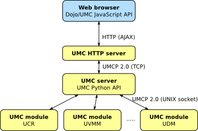

============
Architecture
============

The Univention Management Console service consists of four
components. The communication between these components is encrypted
using SSL. The figure :ref:`figure-umc-archiecture` shows the
architecture and the communication channels.

.. _figure-umc-archiecture:

	Architecture of UMC

* The *UMC server* is the core component. It provides access to the
  modules, manages the connection and verifies that only authorized
  users get access. The protocol used to communicate is the Univention
  Management Console Protocol (UMCP) in version 2.0.

* The *UMC HTTP server* is a small web server that provides HTTP
  access to the UMC server. It is used by the web frontend.

* The *UMC module* processes are forked by the UMC server to provide
  a specific area of management tasks within a session.

----------------------
Asynchronous Framework
----------------------

All server-side components of the UMC service are based on the
asynchronous framework Python Notifier, that provides techniques for
handling quasi parallel tasks based on events. The framework follows
three basic concepts:

* *Non-blocking sockets* Servers that should be handling several
  communication channels at the same time have to use so called
  non-blocking sockets. This is an option that needs to be set for each
  socket, that should be managed by the server. This is necessary
  to avoid blocking on read or write operations on the sockets.

* *Timer* To perform tasks after a defined amount of time the
  framework provides an API to manage timer (one shot or periodically).

* *Signals* To inform components within a process of a specific
  event the framework provides the possibility to define
  signals. Components being interested in events may place a
  registration.

Further details, examples and a complete API documentation for Python
Notifier can be found at the website of the project
`Python Notifier website <http://blog.bitkipper.net/?page_id=51>`_.
