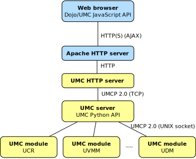

============
Architecture
============

The Univention Management Console service consists of three
components. The communication between these components is done
using UNIX sockets. The figure :ref:`figure-umc-archiecture` shows the
architecture and the communication channels.

.. _figure-umc-archiecture:

	Architecture of UMC

* The *UMC server* is a HTTP server based on Tornado. It provides access to the
  modules, manages the connection and verifies that only authorized
  users get access. It it proxied behind an Apache web server,
  which handels the https: connection from the web frontend.

* The *UMC module* processes are forked by the UMC server to provide
  a specific area of management tasks within a session.
