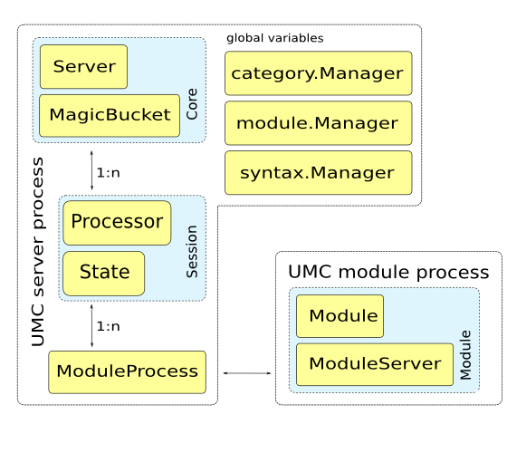

========
Protocol
========

UMC uses its own protocol for internal communication that is optimized
for the needs of UMC. The following documents the specification of the
protocol and the message format as well as the API of the Python
implementation.

-------------
Specification
-------------

.. automodule:: univention.management.console.protocol
	:members:
	:undoc-members:
	:show-inheritance:

----------
Python API
----------

The following documents the API of all components implementing parts of
the Univention Management Concole Protocol (UMCP). The figure
:ref:`figure-core-structure` showns the relations between the classes
implementing the UMC service.

.. _figure-core-structure:

	core structure of the UMC implementation

Messages
========

.. automodule:: univention.management.console.protocol.message
	:members:
	:undoc-members:
	:show-inheritance:
	:member-order: bysource

Server, client and session
==========================

.. automodule:: univention.management.console.protocol.server
	:members:
	:undoc-members:
	:show-inheritance:

.. automodule:: univention.management.console.protocol.client
	:members:
	:undoc-members:
	:show-inheritance:

.. automodule:: univention.management.console.protocol.modserver
	:members:
	:undoc-members:	
	:show-inheritance:

.. automodule:: univention.management.console.protocol.session
	:members:
	:undoc-members:
	:show-inheritance:
