# Theme CSS Variables

UCS provides two themes, 'light' and 'dark'.
The theme files can be found under `/usr/share/univention-web/themes/dark.css` and
`/usr/share/univention-web/themes/light.css` on a UCS system on consist solely of CSS variables which are
throughout the other CSS files.
The only thing that changes between `dark.css` and `light.css` are colors, but they also contain
CSS variables that control other aspects of the design.

Some additional CSS variables can be found in `ucs/management/univention-web/css/themes/_vars.styl` which
are not part of the theme files but are also explained here.

The definition and usage of these variables has multiple purposes
- Homogeneity: Define a set of variables for certain use cases, like which font sizes should be used, and only use those sets of variables. This ensures a consistent feeling in the frontend.
- Maintainability: If mostly CSS variables are used throughout the CSS files, it is easier to make sweeping changes and reason about them.
- Light/Dark: Easy change between light and dark theme. Switching theme only changed css variables
- Color theming: Theme of frontend can be easily achieved by just changing values of CSS variables.
- Customer theming: Allows customers to theme the frontend in an easier way.

The following sections explain the CSS variables:

## --cursor-disabled

Intended for `cursor` property.

Defines value for `cursor` property, when action is not allowed or performable.
Not necessarily useful since there is no other related possible value than `not-allowed`.
But it allows easier global style change, and customer theming.

## border-radius variables

### --border-radius-interactable

Intended for `border-radius` property.

Defines value for `border-radius` property of interactable elements.
Used for things like:

- input elements (e.g. TextBox, Select etc.)

  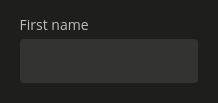

- buttons

  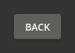

### --border-radius-container

Intended for `border-radius` property.

Defines value for `border-radius` property of elements that contain other elements.

Used for things like:

- Grids

  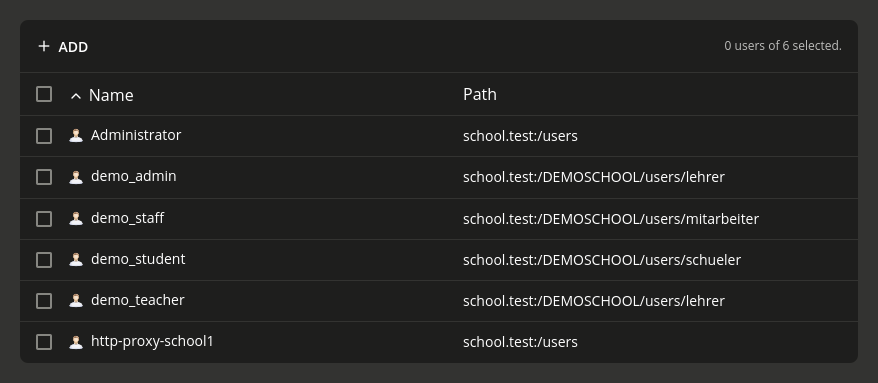

- Modals

  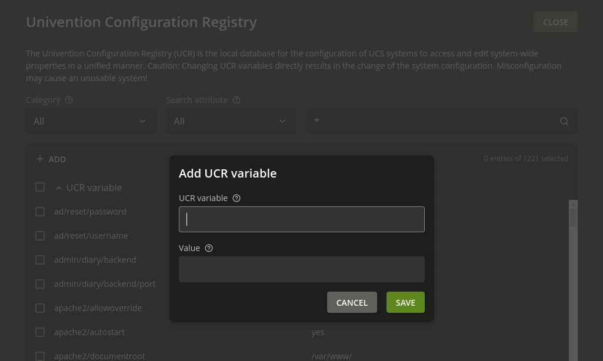

- Page navigation and content

  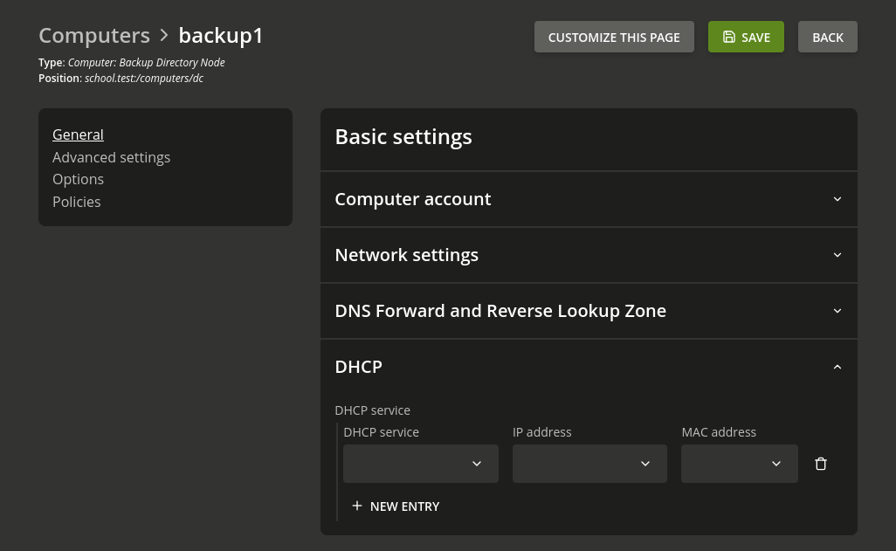

### --border-radius-notification

Intended for `border-radius` property.

Defines value for `border-radius` property of notifications.

- Header notifications

  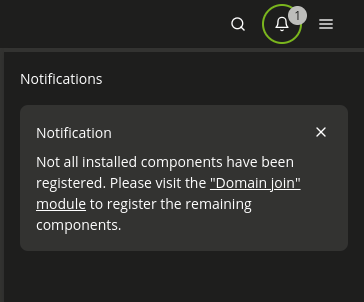

- Snackbar notifications

  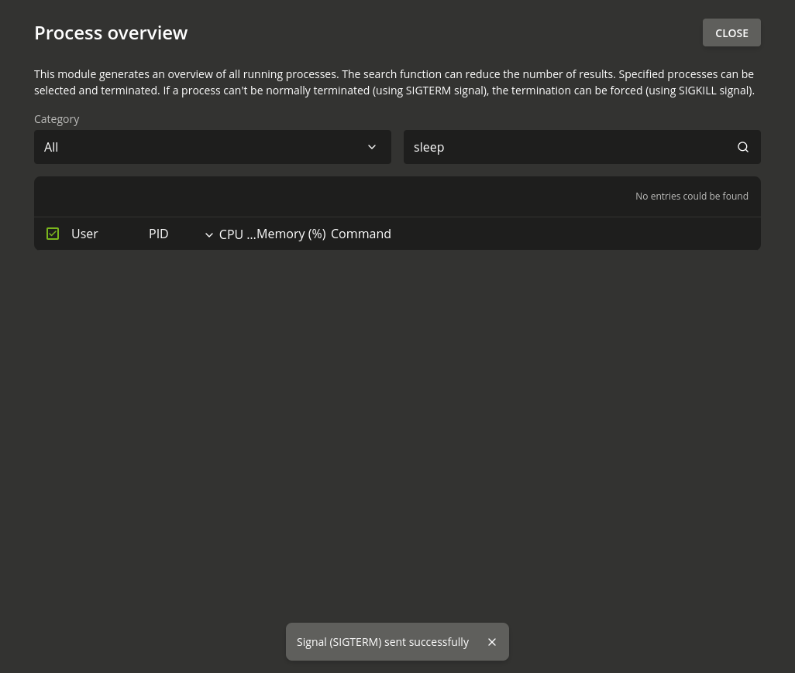

### --border-radius-tooltip

Intended for `border-radius` property.

Defines value for `border-radius` property of tooltips.

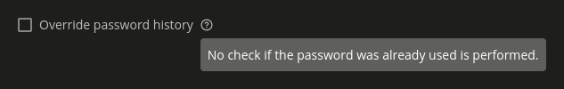

### --border-radius-circles

Intended for `border-radius` property.

Defines value for `border-radius` property of elements that should be round.

## Layout

### --layout-spacing-unit

Intended for `padding`, `margin`, `gap`, `top`, `right`, `bottom`, `left`
and to some extent `height` and `width` properties.

For the frontend to have a consistent feeling whitespace/spacing between elements
and to some extent fixed height of elements is managed via the `--layout-spacing-unit`
variable.

Every padding or margin should be a multiple of `--layout-spacing-unit` or half of
`--layout-spacing-unit` (`--layout-spacing-unit-small`).

This created a grid-like feeling for the elements to slot into.

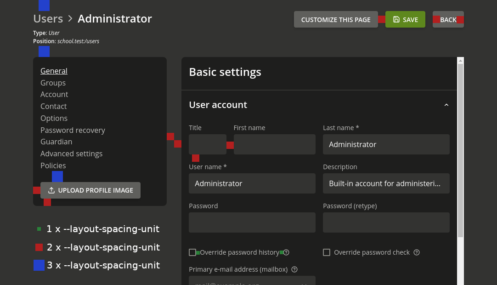

Do note that it is only grid-like since the width and height of elements is also
dependent on the content. E.g. a button is not multiples of `--layout-spacing-unit`
wide, but depends on the text of the button.

### --layout-spacing-unit-small

Intended for `padding`, `margin`, `gap`, `top`, `right`, `bottom`, `left`
and to some extent `height` and `width` properties.

The smallest unit you should use for spacing.
Should be half of `--layout-spacing-unit`.

### --layout-height-header

Intended for the `height` property of website header.

Used for the `height` property of the header.

Used mainly to define consistent header height for different websites (/univention/login, /univention/portal)
and make changing it easier.

### --layout-height-header-separator

Spacing between header and portal iframes and opened menus.

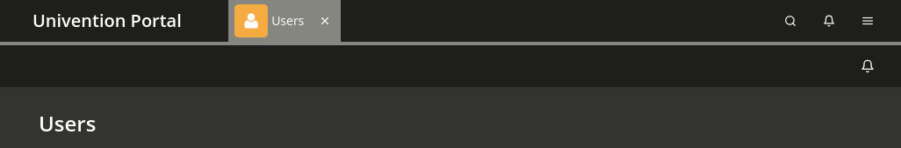

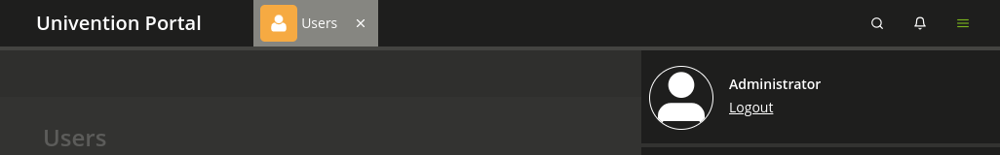

### --inputfield-size

Used for the `height` property of text boxes and selects.

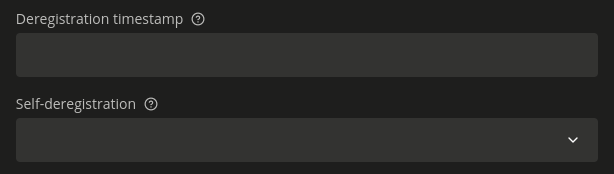

## Colors

### --color-focus

Intended for `border-color` or `outline` property.

Color for outline of focused elements. Should be highly visible.

### --color-accent

Can be used to add some color to certain elements.

Should not be used as text color or background color. See TODO [contrast matrix].

At the moment only used to highlight selected or activated elements:

- Checkboxes

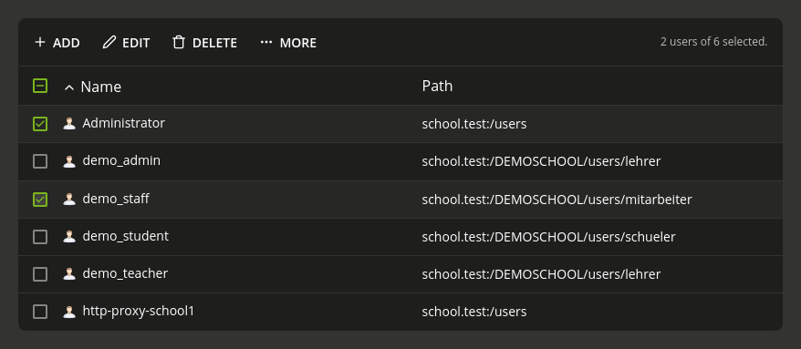

- Active state of toggle buttons

(At the moment UMC and portal have different styles)

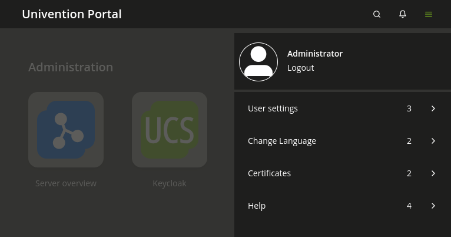

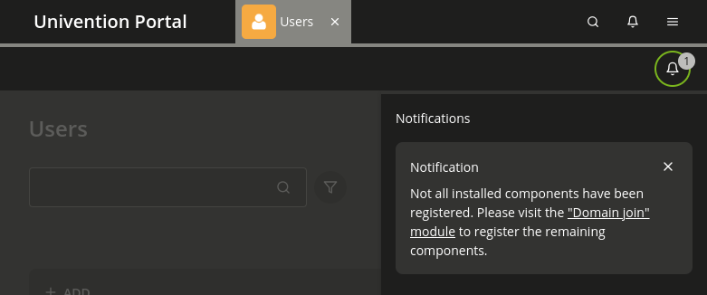

- Selected elements

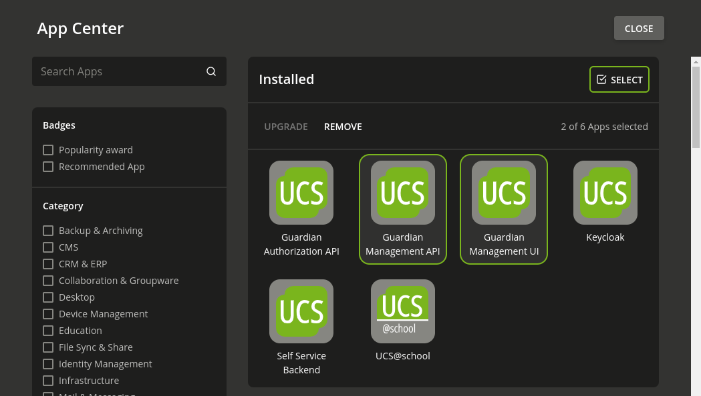

### --bgc-content-body

Intended for `background-color` and `border-color` properties.

Expects text on this color to be readable. See TODO

Defines the background color for the whole page.
Is also used as alternating background color for
elements in `--bgc-content-container` elements.

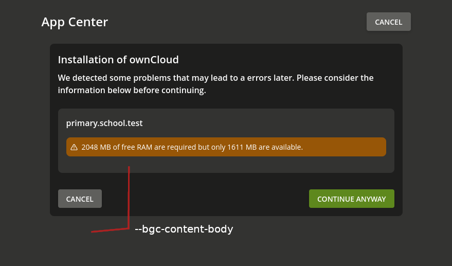

Is also used as color for separator lines.

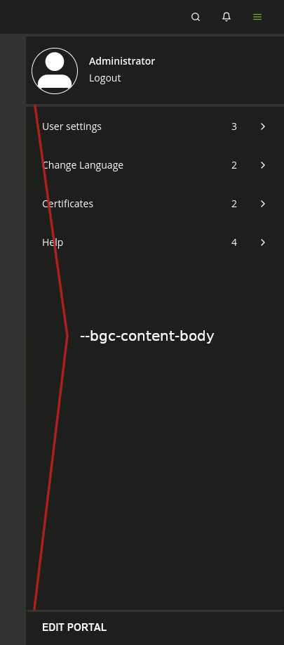

### --bgc-content-container

Intended for `background-color` and `border-color` properties.

Expects text on this color to be readable. See TODO

Defines background color for elements that contain other elements
and sit on the body.

### --bgc-content-header

Intended for the `background-color` property of website headers.

Defines the background color of the website header.
In the default `dark` and `light` theme it is the same as
`--bgc-content-container`. It is its own variable for theming for customers.

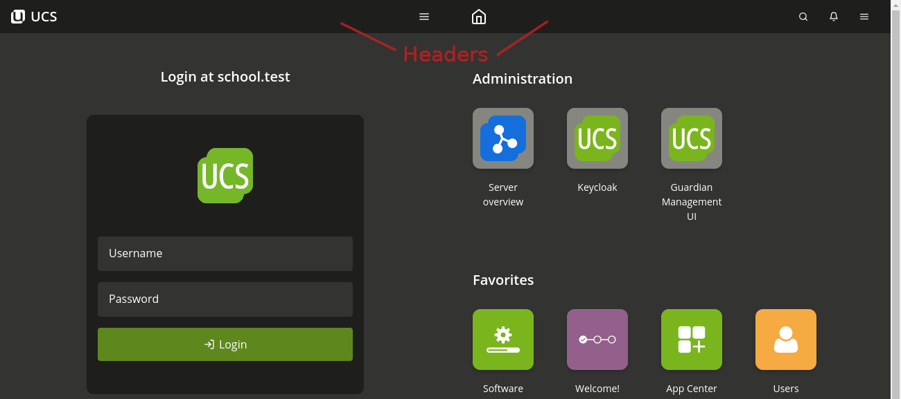

### --bgc-inputfield-on-container

Intended for `background-color` property.

Expects text on this color to be readable. See TODO

Defines the background color of input elements that are inside
a `--bgc-content-container` element.

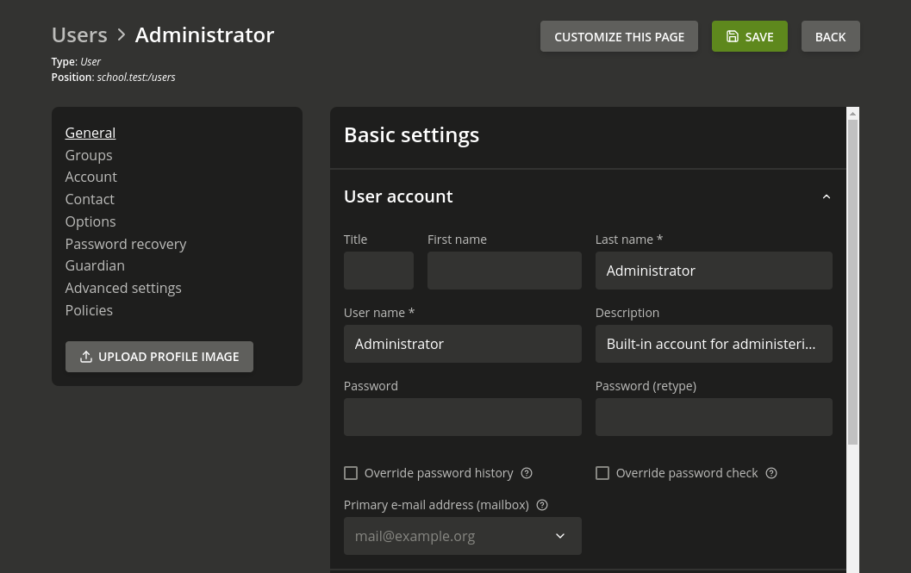

### --bgc-inputfield-on-body

Intended for `background-color` property.

Expects text on this color to be readable. See TODO

Defines the background color of input elements that sit on
`--bgc-content-body` elements.

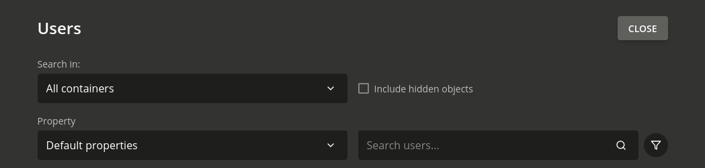

### --bgc-checkbox-hover

Intended for `background-color` property.

Defines the background color of hovered checkboxes.

### --bgc-checkbox-focus

Intended for `background-color` property.

Defines the background color of focused checkboxes.

### --bgc-loading-circle

Defines the color of the loading circle.

Should be visible on `--bgc-underlay`.

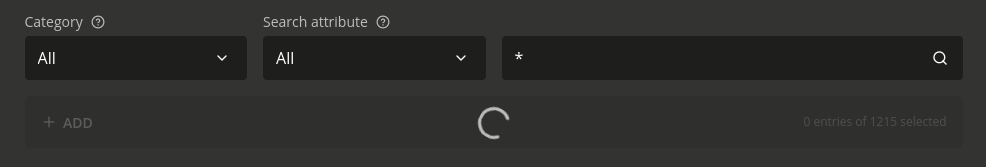

### --bgc-underlay

Intended for `background-color` property.

Defines the background color of the backdrop element of modals and standby-ing elements.

- Modals

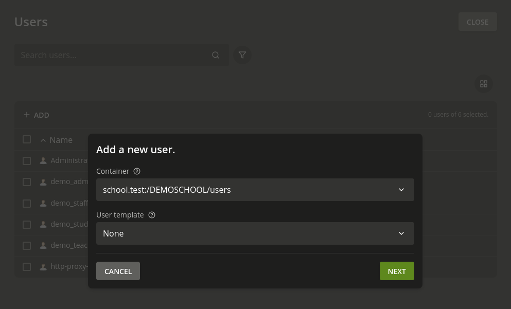

- Standby

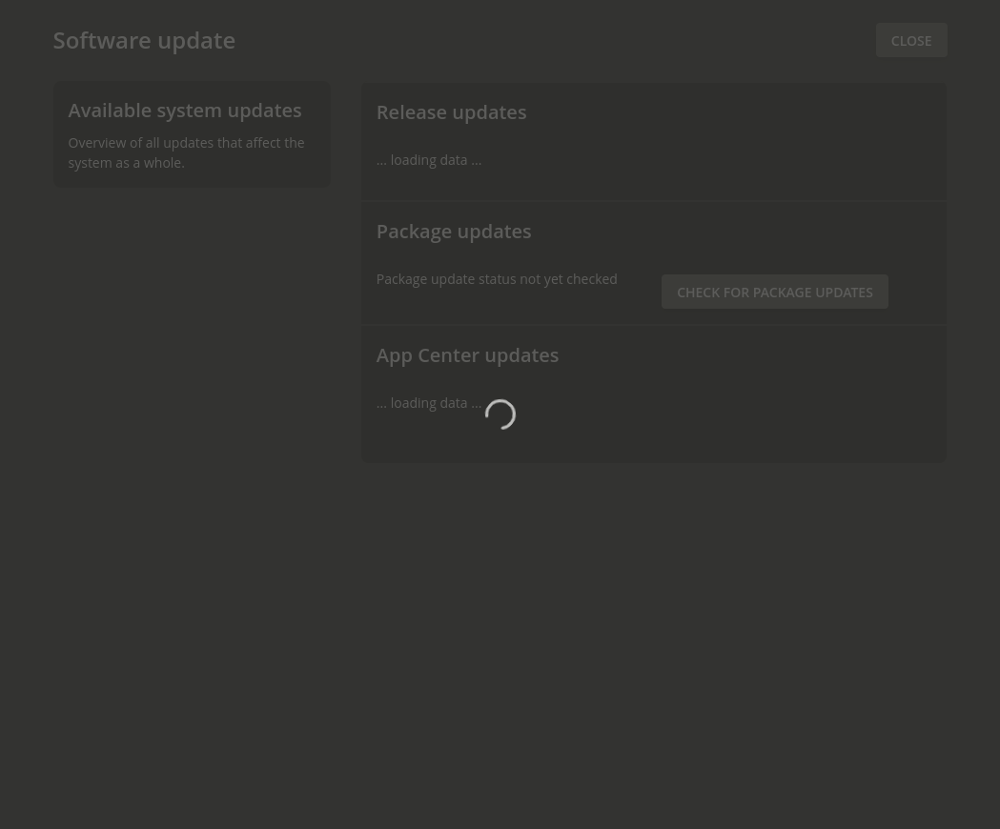

### --bgc-user-menu-item-hover

Intended for `background-color` property.

Defined the background color of hovered menu items of the header menu.

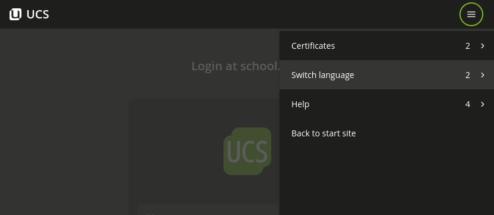

### --bgc-user-menu-item-active

Intended for `background-color` property.

Defined the background color of active menu items of the header menu.

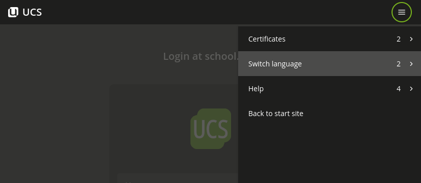

### --bgc-header-number-circle

Intended for `background-color` property.

Defines the background color of the notifications number circle.

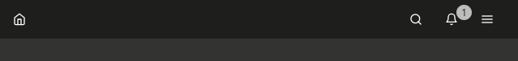

### --bgc-popup, --bgc-popup-item-hover, --bgc-popup-item-active, --bgc-popup-item-selected

Intended for `background-color` property.

Expects text on this color to be readable. See TODO

`--bgc-popup` defines the background color of popups. Since they can lay on top of
`--bgc-content-body` and `--bgc-content-container` the color should be
distinguishable from both.

`--bgc-popup-item-hover`, `--bgc-popup-item-active` and `--bgc-popup-item-selected`
define the background color of different states of selectable items inside popups, like
menus or calendars.

- Tooltips

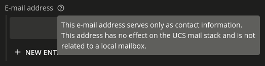

- Menus

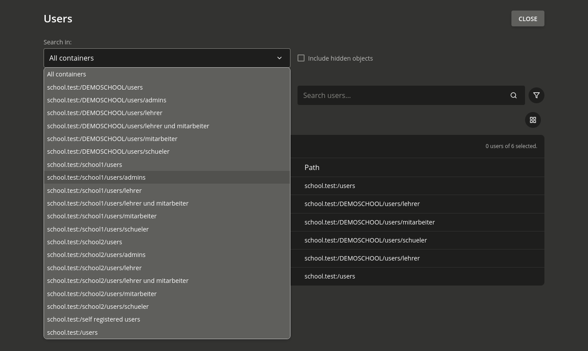

- Calendars

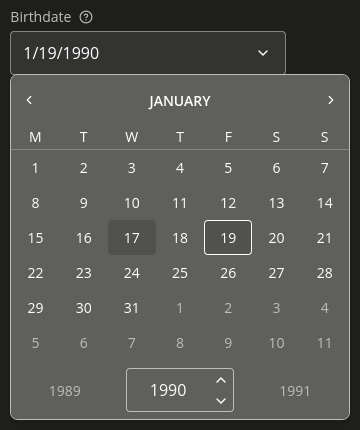

### --bgc-grid-row-hover, --bgc-grid-row-selected, --bgc-tree-row-hover, --bgc-tree-row-selected

Intended for `background-color` property.

Defines the background color of hovered and selected grid and tree items.

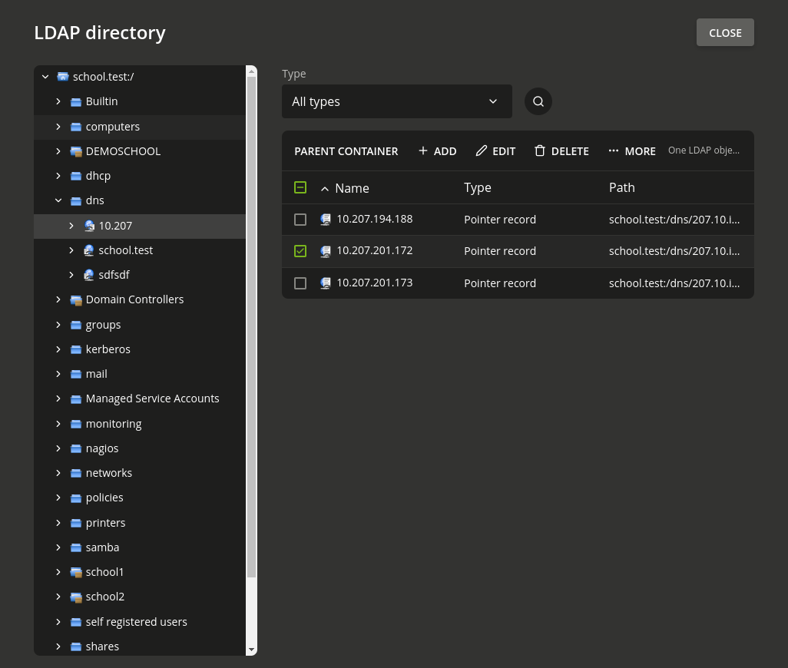

### --bgc-apptile-default, --bgc-appcenter-app-hover, --bgc-appcenter-app-active

Intended for `background-color` property.

`--bgc-apptile-default` defines the background color of app tiles in the App Center UMC module
and the portal.

`--bgc-appcenter-app-hover` and `--bgc-appcenter-app-active` define the background color
of hovered and active app tiles in the App Center UMC module.

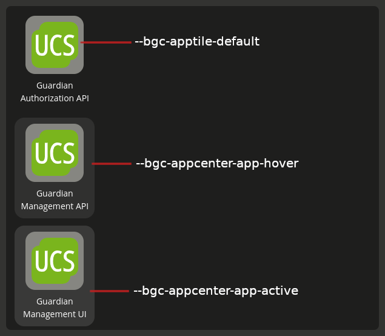

### --bgc-progressbar-empty, --bgc-progressbar-progress

Defines the color of the empty and progressed part of a progressbar.

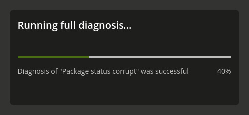

### --bgc-titlepane-hover

Intended for `background-color` property.

Defines the background color of hovered TitlePane headers.

### --bgc-checkerboard

Intended for `background` property.

Defines the background for the ImageUploader widget.

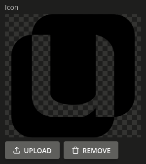

### Success, warning and error colors

#### --bgc-success and --font-color-success

`--bgc-success` is intended for `background-color` property.

`--font-color-success` is intended for `color` property.

Can be used in situations where an operation was successful.

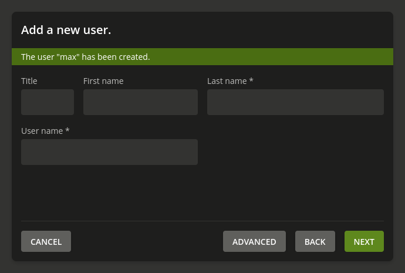

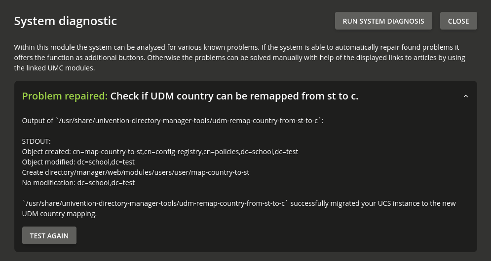

#### --bgc-warning and --font-color-warning

`--bgc-warning` is intended for `background-color` property.

`--font-color-warning` is intended for `color` property.

Can be used in situations where a problem exists and should be considered by the user,
but the problem does not necessarily stall operation.

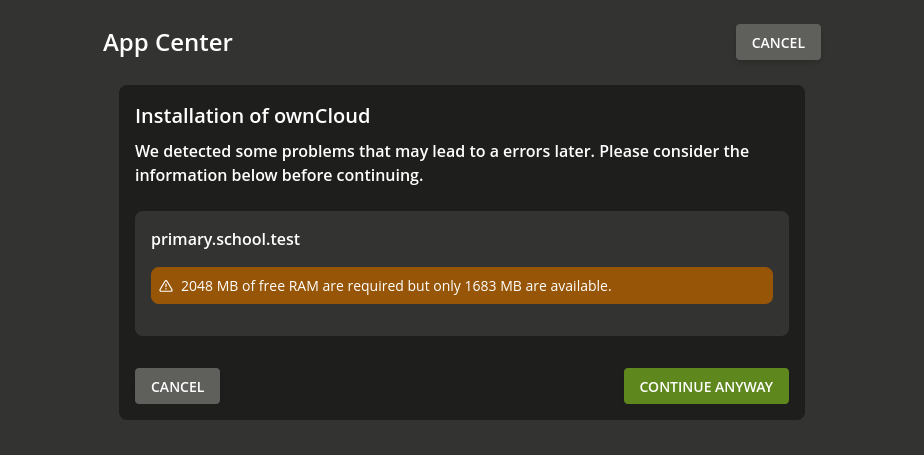

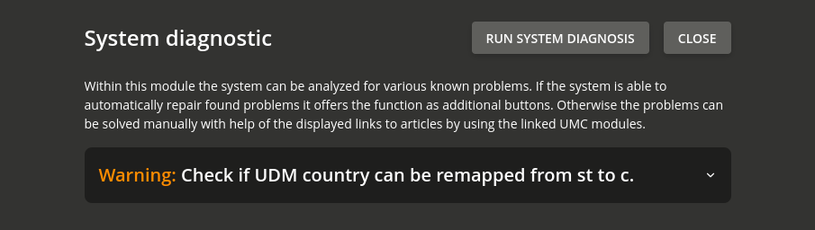

#### --bgc-error and --font-color-error

`--bgc-error` is intended for `background-color` property.

`--font-color-error` is intended for `color` property.

Can be used in situations where a problem exists that causes the system to not work properly
or an operation can't be continued.

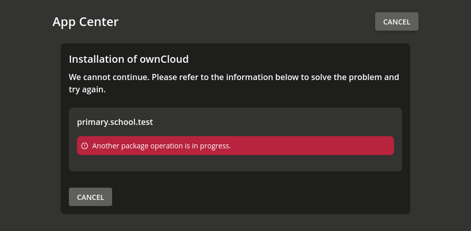

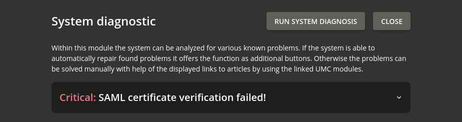

## Font

We define 5 different font sizes that we can use, named `--font-size-1` through `--font-size-5` with `--font-size-1`
being the largest font size. The 5 font sizes all use `rem` as a unit and are therefore relative to the
root font size of the `<html>` element. The root font size is defined with `--font-size-html`.

### --font-size-html

Intended for the `font-size` property of the `<html>` tag.

Defines the root font size for the website. In the current style it is set to `1rem` which means that
the default font size of the browser is used which is typically 16px. We don't overwrite it with a fixed
px size so that the user settings are adhered to, e.g. if they set it to a bigger font size.

### --font-size-body

Intended for the `font-size` property of the `<body>` tag.

Defines the default font size for text if it is not specifically overwritten.
Main use is for continuous text like the description of UMC modules. Uses `--font-size-4`.

### --font-size-{1..5}

- `--font-size-1`: The largest font-size. Used for headings.
- `--font-size-2`: Used for sub-headings.
- `--font-size-3`: Same as `--font-size-html`; `1rem`. Mainly used for input elements.
- `--font-size-4`: Default font-size. Used for continuous text.
- `--font-size-5`: Smallest font-size. Used for supplementary information that does not need the focus of the user.

### --font-lineheight-normal

Intended for `line-height` property.

Default line height if not overwritten.

### --font-lineheight-compact

Intended for `line-height` property.

Can be used if text should take up less space.

### --font-lineheight-header

Intended for `line-height` property.

Lineheight for headings.

### --font-weight-bold

Intended for `font-weight` property.

The only other font weight that should be used.

Used to emphasize headings and buttons.

### font colors

Beside `--font-color-success`, `--font-color-warning` and `--font-color-error` there are
3 main font colors that should be used: `--font-color-contrast-high`,
`--font-color-contrast-middle` and `--font-color-contrast-low`.

When using these font color variables make sure that they have a good contrast against the background.
Everything below 4.5 should not be used. Also look at the worst contrast between dark and light when deciding
whether a contrast is good enough.

When changing the font color or background color variables make sure that the contrast does not get worse.

Blank cell combinations should not be used anyway.

Dark theme

|                               | --font-color-contrast-high | --font-color-contrast-middle | --font-color-contrast-low | --font-color-success | --font-color-warning | --font-color-error |
|-------------------------------|----------------------------|------------------------------|---------------------------|----------------------|----------------------|--------------------|
| --bgc-content-container       | 16.68                      | 8.87                         | 4.56                      | 9.24                 | 7.15                 | 6.06               |
| --bgc-content-header          | 16.68                      | 8.87                         | 4.56                      | 9.24                 | 7.15                 | 6.06               |
| --bgc-inputfield-on-body      | 16.68                      | 8.87                         | 4.56                      | 9.24                 | 7.15                 | 6.06               |
| --bgc-content-body            | 12.66                      | 6.73                         | 3.46                      | 7.01                 | 5.43                 | 4.60               |
| --bgc-inputfield-on-container | 12.66                      | 6.73                         | 3.46                      | 7.01                 | 5.43                 | 4.60               |
| --bgc-popup                   | 6.41                       | 3.40                         | 1.75                      | 3.55                 | 2.75                 | 2.33               |
| --bgc-success                 | 6.02                       | 3.20                         | 1.65                      |                      |                      |                    |
| --bgc-warning                 | 5.75                       | 3.06                         | 1.57                      |                      |                      |                    |
| --bgc-error                   | 6.27                       | 3.33                         | 1.71                      |                      |                      |                    |
| --button-primary-bgc          | 4.18                       |                              |                           |                      |                      |                    |
| --button-bgc                  | 6.40                       |                              |                           |                      |                      |                    |

Light theme

|                               | --font-color-contrast-high | --font-color-contrast-middle | --font-color-contrast-low | --font-color-success | --font-color-warning | --font-color-error |
|-------------------------------|----------------------------|------------------------------|---------------------------|----------------------|----------------------|--------------------|
| --bgc-content-container       | 14.50                      | 7.26                         | 4.56                      | 4.74                 | 4.54                 | 6.14               |
| --bgc-content-header          | 14.50                      | 7.26                         | 4.56                      | 4.74                 | 4.54                 | 6.14               |
| --bgc-inputfield-on-body      | 14.50                      | 7.26                         | 4.56                      | 4.74                 | 4.54                 | 6.14               |
| --bgc-content-body            | 16.68                      | 8.35                         | 5.25                      | 5.45                 | 5.23                 | 7.07               |
| --bgc-inputfield-on-container | 11.58                      | 5.80                         | 3.65                      | 3.79                 | 3.63                 | 4.91               |
| --bgc-popup                   | 8.87                       | 4.44                         | 2.79                      | 2.90                 | 2.78                 | 3.76               |
| --bgc-success                 | 6.60                       | 3.30                         | 2.08                      |                      |                      |                    |
| --bgc-warning                 | 9.29                       | 4.65                         | 2.92                      |                      |                      |                    |
| --bgc-error                   | 7.19                       | 3.60                         | 2.26                      |                      |                      |                    |
| --button-primary-bgc          | 6.71                       |                              |                           |                      |                      |                    |
| --button-bgc                  | 8.86                       |                              |                           |                      |                      |                    |

# UMC modules

Each UMC module inherits from `umc/widgets/Module`. `Module` consists of two parts: the header and the stack container.

The header contains the module name on the left side and the main actions as buttons on the right side.
The rightmost button should always be either the close button for the module, if we are on the initial page
of the module, or a back button, if we are on a subpage of the module.

- Initial page of "Groups" module

  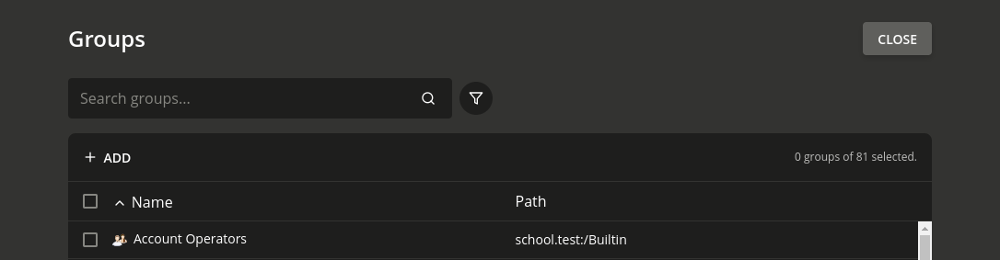

- Subpage of "Groups" module

  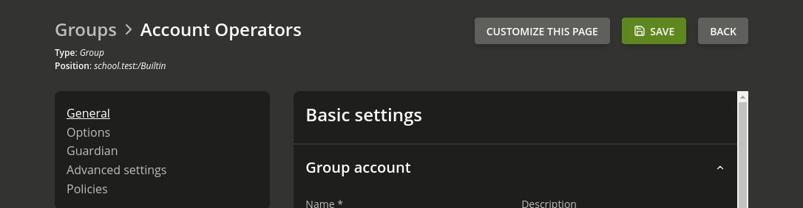

To the left of the close/back button is the main action of the current page and that button
should use the `--button-primary-bgc` style.
Additional actions are to the left of that in the normal button style.

The stack container can contain multiple `umc/widgets/Page`s of which only one is visible at a time.
A `Page` consists of two parts: the 'nav' and the 'content'.
The 'nav' and 'content' are stacked on small screens:

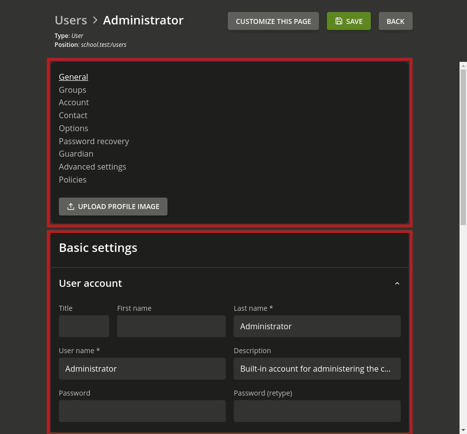

On big screens they are side by side:

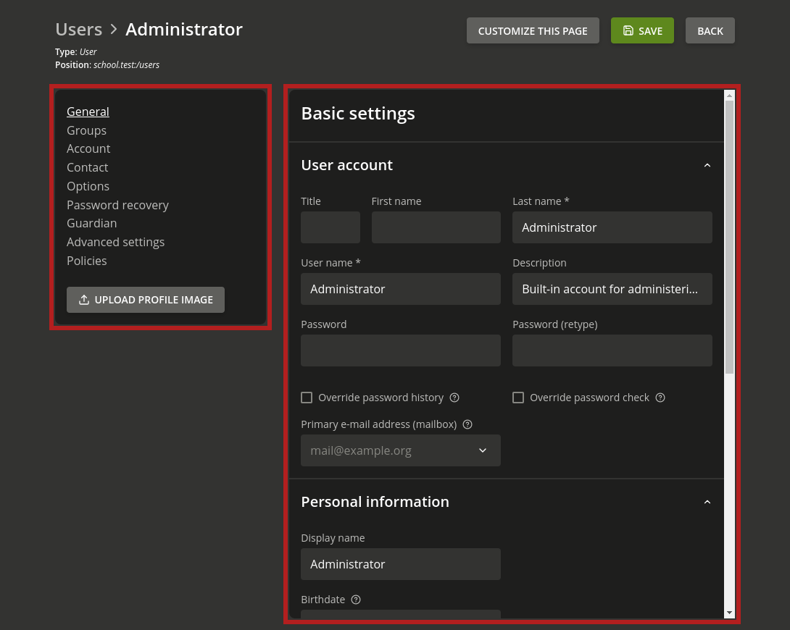

The 'nav' and 'content' can be forced to be vertically stacked with the `fullWidth` property of `umc/widgets/Page`.
This is mostly a question about what looks best.

Text in the 'nav' like the `helpText` and `headerText` of a `Page` should be displayed
directly on the body:

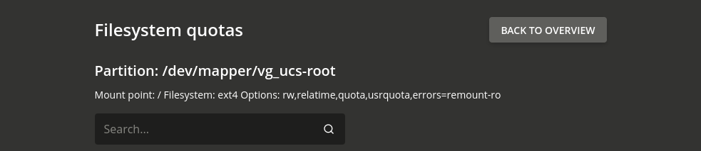

Additionally, search form elements or navigational elements should be put in the 'nav'.
These interactable elements should be displayed with `--bgc-content-container` color.

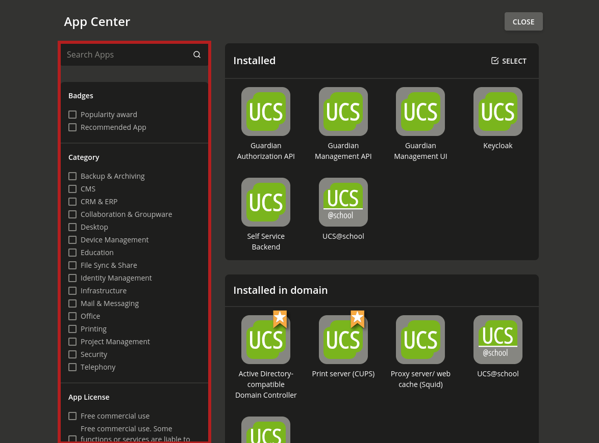

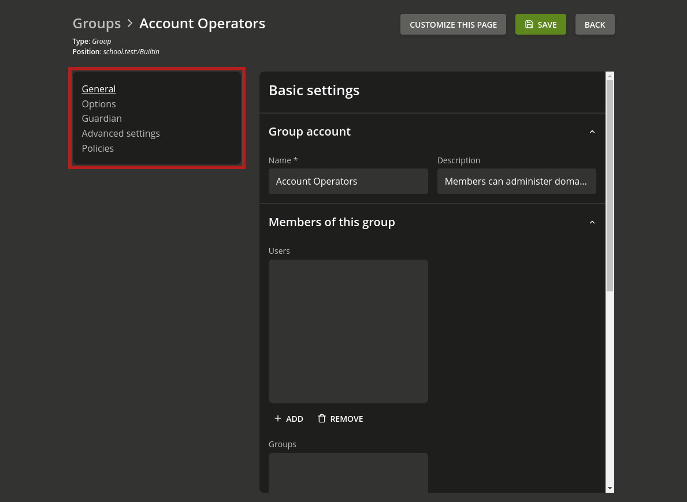

The children of the 'content' should always be put in a container with `--bgc-content-container`
or be a container themselves like a `Grid`.

# Notifications

The UMC has two forms of notifications:

- Header notifications

Shown in the top right of the screen and preserved in notifications menu until dismissed.

Use them for notifications that can be understood in isolation and/or should be long visible.

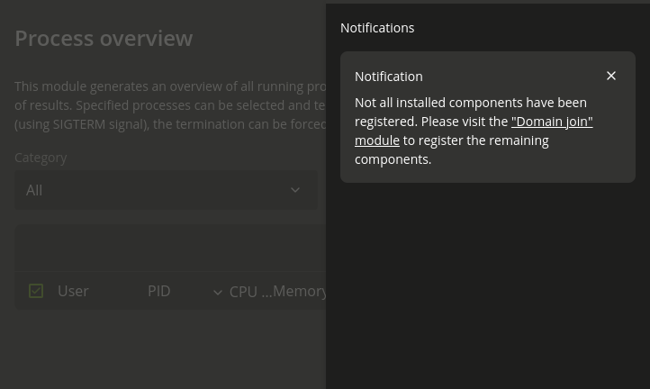

- Snackbar notifications

Shown at the bottom of the screen for a couple of seconds. After they disappear they cannot be seen again.

Use them for confirmation/acknowledgment of just performed actions that do not need to be persistent.

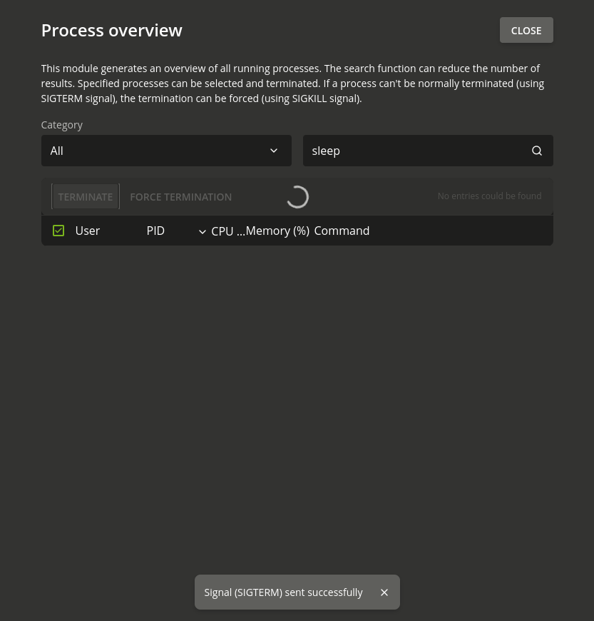
